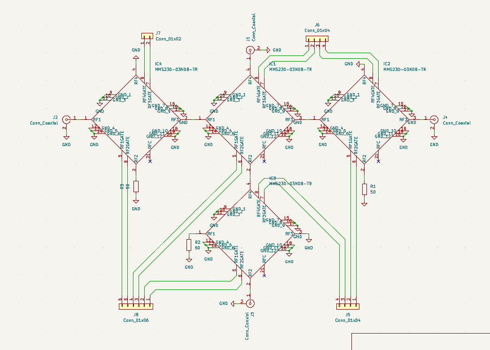
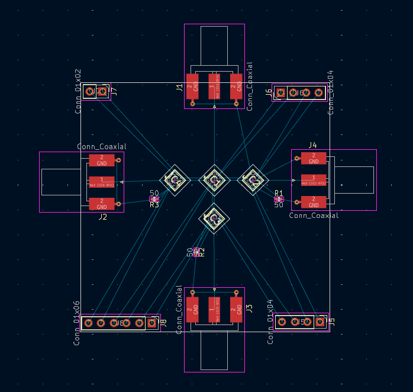
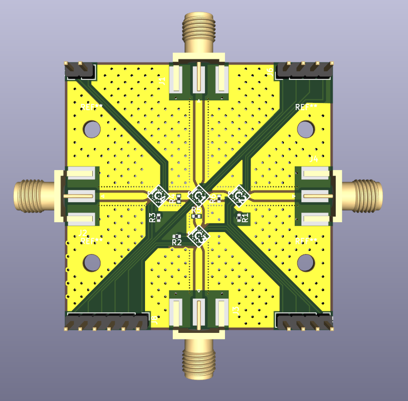

# [sp3t-ecal](https://github.com/lafefspietz/sp3t-ecal)

Open source MEMS-based single pole three throw circuit board with improved impedance matching and SMA launches. This is in a rough draft status now, and is in active development.  This is to become a part of a system which will have two of these switch boards and a set of breakout baords for connecting the DC control lines to these RF switch boards, and to then connect to the 25 pin mirco D which is standard in most cryogenic systems used for superconducting quantum systems. Board is 50 mm square. 
 
 - [SP3TECAL.kicad_sch](SP3TECAL.kicad_sch)
 - [SP3TECAL.kicad_pcb](SP3TECAL.kicad_pcb)
 - [SP3TECAL.kicad_pro](SP3TECAL.kicad_pro)
 - [MM5230-03NDB-TR.lib](MM5230-03NDB-TR.lib)
 - [lafe_spietz_library.kicad_sym](lafe_spietz_library.kicad_sym)

## Screen shot of schematic draft:

## Screen shot of layout draft:

## Screen shot of 3d:

